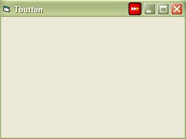



## TButton

### Description

TButton Class Draws a button Image on a Forms Title Bar and raises Click ,DblClick Events when user clicks on button.

Nice clean wrapped up code wish somebody needs it!!

Suggestion &amp; Comments are Welcome Thanks
 
### More Info
 

             |
---                |---
**Submitted On**   |2009-03-20 19:52:12
**By**             |[Nitin Kohli](https://github.com/Planet-Source-Code/PSCIndex/blob/master/ByAuthor/nitin-kohli.md)
**Level**          |Intermediate
**User Rating**    |4.5 (18 globes from 4 users)
**Compatibility**  |VB 5\.0, VB 6\.0
**Category**       |[Custom Controls/ Forms/  Menus](https://github.com/Planet-Source-Code/PSCIndex/blob/master/ByCategory/custom-controls-forms-menus__1-4.md)
**World**          |[Visual Basic](https://github.com/Planet-Source-Code/PSCIndex/blob/master/ByWorld/visual-basic.md)
**Archive File**   |[TButton2147383222009\.zip](https://github.com/Planet-Source-Code/nitin-kohli-tbutton__1-71889/archive/master.zip)

